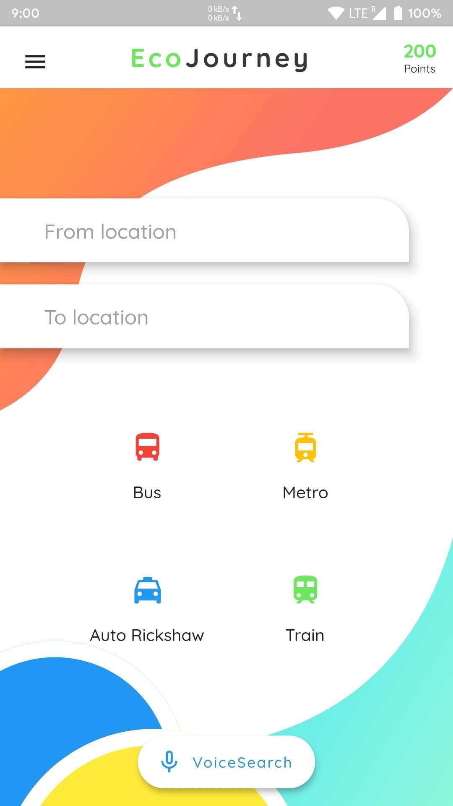

<p align="center">
    
</p>
<p align="center">
  EcoJourney is an Optimum Travel Planner which suggests you the best routes available using public transport and also provides reward points as an add-on.
</p>

|                     Home Screen                   |                    Voice Search                   |                       Rewardz                     |
|:-------------------------------------------------:|:-------------------------------------------------:|:-------------------------------------------------:|
|  |  |  |
|  |  |  
|                    **App Drawer**                 |                 **Search Language**               |                     **Settings**                  |

## :rocket: Get Up and Running in 5 Minutes

You can get the EcoJourney App up and running on your local dev environment in 5 minutes with these four steps:

1. **Install the Flutter SDK & Android Studio. [Instructions](https://medium.com/enappd/install-flutter-on-windows-and-mac-1fd1dde453ba).**

2. **Open Terminal & navigate to the root directory of the project.**

    ```shell
    cd EcoJourney
    ```

3. **Run and launch the build on preferred device.**

   ```shell
   flutter run
   ```

4. **Open the source code and start editing!**

   Your app is now running on your physical device or emulator. Open the `lib` directory in Android Studio itself and edit `*.dart` files. Hot Reload your changes, and the app will update in real time!

At this point, you’ve got the fully functional EcoJourney App running. For additional information on how you can customize your Flutter Apps, see [Google Codelabs](https://codelabs.developers.google.com/codelabs/flutter/) and [HackerNoon Guide](https://hackernoon.com/making-the-most-of-flutter-from-basics-to-customization-433171581d01).

## :ballot_box: Flutter / Dart Packages Used
|    Package Name    	| Package Version 	|                           Package URL                          	|
|:------------------:	|:---------------:	|:--------------------------------------------------------------:	|
|    intro_slider    	|      latest     	|    [Open on pub.dev](https://pub.dev/packages/intro_slider)    	|
|        http        	|      latest     	|        [Open on pub.dev](https://pub.dev/packages/http)        	|
|    flutter_html    	|      latest     	|    [Open on pub.dev](https://pub.dev/packages/flutter_html)    	|
| shared_preferences 	|      latest     	| [Open on pub.dev](https://pub.dev/packages/shared_preferences) 	|
| permission_handler 	|      latest     	| [Open on pub.dev](https://pub.dev/packages/permission_handler) 	|
|    url_launcher    	|      latest     	|    [Open on pub.dev](https://pub.dev/packages/url_launcher)    	|
| speech_recognition 	|      latest     	| [Open on pub.dev](https://pub.dev/packages/speech_recognition) 	|
|      scratcher     	|      latest     	|      [Open on pub.dev](https://pub.dev/packages/scratcher)     	|

